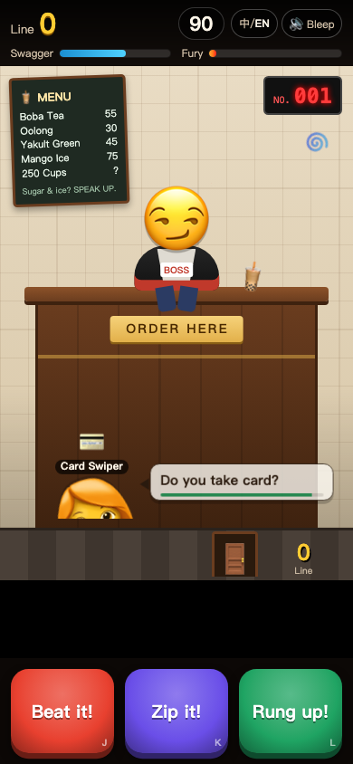
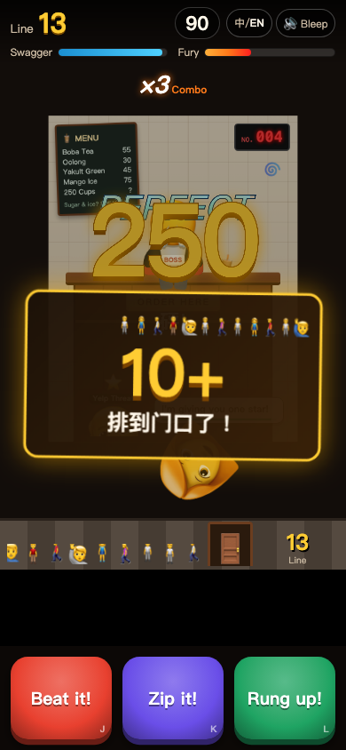

# 来250杯原型复验报告

验收日期：2026-10-02。被测提交：`f12761e`。本报告复验最新代码，更新[首次验收报告](acceptance-report-2026-10-02.md)中的结论，遵循[验收清单](acceptance-checklist.md)的 G 节格式。

结论：A1–A4 自动化检查全部通过。语音包缺失、#24 性别台词和普通顾客状态下的中英切换已解决。D10 仍有一个可复现的遗漏：里程碑卡片显示时切换英文，卡片文字仍为中文。真实设备上的音色、情绪、混音和听感尚未验收，因此不宣布整份清单全部通过。

环境：macOS、Node v25.2.1、Playwright 1.63.0、Chromium 153.0.8010.12；使用最新清单提供的本机安装方式。npm 依赖位于 git 忽略的 `game/tools/node_modules`，浏览器缓存位于 `/private/tmp/naicha-pw-browsers`，运行浏览器脚本时设置同名 `PLAYWRIGHT_BROWSERS_PATH` 环境变量。本次未修改游戏源代码。

## 逐项结果

命令均从 `game/` 执行。⚠️ 为部分验证，不能视为真机听音通过。

| 编号 | 结果 | 证据 |
|---|---|---|
| A1 | ✅ 通过 | `node --test test/*.test.mjs`：`tests 45`、`pass 45`、`fail 0`，退出码 0。 |
| A2 | ✅ 通过 | `node tools/check-content.mjs`：`17/17 checks passed`，退出码 0；覆盖 zh 361/361、en 357/357 条引用。 |
| A3 | ✅ 通过 | `node tools/play-integrate.mjs` 退出码 0；`errors: []`、`overflow: false`、`againPhase: playing`。[完整输出](acceptance-recheck-smoke-2026-10-02.json)。 |
| A4 | ✅ 通过 | `node tools/qa.mjs`：`21/21 passed`，退出码 0；7 场景 × 390×844、360×640、1280×800。[完整输出](acceptance-recheck-qa-2026-10-02.log)。 |
| B1 | ✅ 通过 | A2：B1-zh、B1-en PASS，各 100 位顾客，编号 1–100。 |
| B2 | ✅ 通过 | A2：B2-zh、B2-en PASS，必需字段、风格、按键均有效。 |
| B3 | ✅ 通过 | A2：B3 PASS，中英文 style、key、cups 完全一致。 |
| B4 | ✅ 通过 | A2：B4-zh、B4-en PASS，系统台词和 signature250 数据完整。完整招牌演出是否接入是另一问题。 |
| C1 | ✅ 通过 | A2：C1 PASS。相对首次逐条审阅，仅修改中文 #24，未新增外送角色。 |
| C2 | ⚠️ 部分 | 自动 C2 PASS；首次报告所列 #28 觉醒、#30 炼丹/alchemy、#96 封印/SEALED 仍在，是否越过中二台词红线仍需内容裁定。 |
| C3 | ✅ 通过 | A2：C3 PASS，`curse=11`；依然是风格分类计数。 |
| C4 | ✅ 通过 | A2：C4 PASS；另用固定随机数在浏览器首位抽到 #47，按收得到金色 250。 |
| C5 | ✅ 通过 | A2：C5 PASS，三句招牌文字仍在。 |
| C6 | ✅ 通过 | A2：C6 PASS，`auraWrong=0`，main.js 无扣分覆盖。 |
| C7 | ✅ 通过 | A2：C7 PASS，气势 60→60、排队 +1；三种尺寸的 wrong 场景均玩满 90 秒、最终气势 60。 |
| C8 | ✅ 已修复明确失败 | #24 alt 改为“这才是懂行的点法”，新 clip 位于 zh-13.mp3，offset=0.12、duration=2.984。首次报告中 #56 胡子舞台指示仍保留为可疑项，没有足够依据将等待时间表现判成外貌嘲讽。 |
| C9 | ✅ 通过 | 相对首次逐条审阅无新增人群豁免；#24 修改仍围绕点单行为。 |
| C10 | ✅ 通过 | 无受保护顾客分支；连续按错场景在三个尺寸均通过，226/225/227 次按键，最终气势都是 60。 |
| D1 | ✅ 通过 | QA 三尺寸开始卡、横向溢出、资源状态和 console 检查通过；smoke errors=[]。 |
| D2 | ✅ 通过 | smoke 开店后 500ms 截图，QA 开店后 150ms 检查进入 playing；顾客、气泡、耐心条正常。 |
| D3 | ✅ 通过 | 三尺寸 correct 场景通过，队伍最终 4358/4368/4328；smoke 覆盖实际 J/K/L 操作、命中和飞离，检查无错误。 |
| D4 | ✅ 通过 | 三尺寸 wrong 场景均 90.0 秒结束、气势 60；C7 直接验证一次错误按键排队 +1。 |
| D5 | ✅ 通过 | 三尺寸 idle 场景均触发 3 次 polite，分别于 9.7/9.6/9.6 秒结束；smoke 记录 polite=1 并截图。 |
| D6 | ✅ 自动流程通过 | 三尺寸 rage 场景均出现 6 次 rageStart、194 次 rageHit；smoke rage=true；8 秒退出仍由引擎单测覆盖，动画听感不在此结论内。 |
| D7 | ⚠️ 部分 | 三尺寸 correct 场景均记录 milestones=3，队伍超过 1000；定向截图确认 10+ 卡片实际出现。尚未逐张人工核对本次实玩 100 与 1000 卡片的完整文字。 |
| D8 | ✅ 通过 | 浏览器固定随机数 0.461，首位 `id=47,key=take`；真实 L 键后 `gold=250,queue=11`。[截图](acceptance-recheck-250-2026-10-02.png)。 |
| D9 | ✅ 通过 | 21 场景均检查战报字段无 undefined/NaN/null，并验证重开为 playing；smoke againPhase=playing。 |
| D10 | ❌ 部分修复仍未通过 | 普通顾客切英文后名称为 Card Swiper、气泡 Do you take card?，旧字幕清空；但里程碑卡片仍显示“排到门口了！”。[数据](acceptance-recheck-targeted-2026-10-02.json)、[问题截图](acceptance-recheck-milestone-2026-10-02.png)。 |
| D11 | ✅ 通过 | 三尺寸 bleep 场景验证 localStorage=1、aria-pressed=true，刷新后仍保留。 |
| D12 | ✅ 已测场景通过 | 360×640 的全部 7 场景通过布局、点击区域、文字截断、战报可达性检查。动画叠加的主观可读性仍见 F4。 |
| E1 | ✅ 自动网络验证通过 | manifest、zh-*.mp3、en-*.mp3 均捕获 HTTP 200；hasVoicePack=true、hasClip(招牌明骂)=true；记录到真实 AudioBufferSource.start 的片段 offset/duration。[数据](acceptance-recheck-targeted-2026-10-02.json)。 |
| E2 | ⚠️ 部分 | 26 个 MP3、712 个唯一主片段存在；客户语音已启动播放，导出器定义不同配音角色。未由人耳核验每位顾客音色。 |
| E3 | ⚠️ 部分 | 舞台指示剥离、clipKey 单测通过；实际片段启动成功，源码有 60ms 淡出路径。未试听店员语音、截断或淡出自然度。 |
| E4 | ⚠️ 部分 | polite 场景和资源覆盖通过，main.js 会调两次不同 boo 文本的 announce；还需真机确认群众两种声音、服务腔和音效同时播放的清晰度。 |
| E5 | ⚠️ 部分 | 里程碑已触发，manifest 含对应语音；源码 announce 使用 speech=false。未试听播报员与店员同时讲话的效果。 |
| E6 | ⚠️ 波形验证通过仍待听音 | #11 消音变体为 zh-1.mp3 的 14.5984 秒起、2.0386 秒长片段；解码后检测到连续约 0.26 秒的 1kHz 纯音，10ms 窗口最高能量占比约 1.0。还需听音确认敏感词被完整覆盖且衔接自然。 |
| E7 | ⚠️ 部分 | 切换 EN 后实际请求 en-0.mp3 等且 HTTP 200；英文内容覆盖完整。尚未完整试听，未验证已排队群众/播报片段在切语言时是否残留旧语言。 |
| E8 | ⚠️ 部分 | smoke/QA 覆盖音效调用，语音请求无错误；代码仍用 WebAudio 合成 SFX。本次未完成真实设备的所有音效听音与混音验收。 |

语音文件还做了独立完整性检查：ffprobe 可读取全部 26 个 MP3；所有 739 个主片段及消音变体的起止点均位于相应音频时长以内（badBounds=[]）。中文分片总时长约 793.03 秒、英文约 678.74 秒，这些数字包含片段间留白。该检查不能替代发音和语义听审。

## 失败项详情

**D10 里程碑卡片未跟随语言切换。** 复现：以中文开店，正确操作直到排队达到 10；“10+ 排到门口了！”卡片仍可见时点击中/EN。实际菜单、HUD 和按键都已英文，但卡片保持中文。定向运行的 queue=13，切换前后 milestone 文本均为“排到门口了！”，normalSwitchPass=true、milestoneSwitchPass=false，page errors=[]。期望卡片立即显示当前语言对应文字。

`main.js:setLang` 新增的 `ui.relabelCustomer` 只重绘顾客并清空字幕，没有重绘当前里程碑卡片。现有 QA 的 english 场景在开店前切英文，不覆盖“里程碑显示期间切换”这一边界，因此 21/21 与本项失败并不矛盾。本次按验收职责记录问题，未更改实现。

上轮失败项的变化：语音 manifest 404 和内容检查 14/17 已解决；#24 性别台词已修改且有新配音；Playwright 本机环境已安装并完成测试；普通顾客名称、气泡和旧字幕的中途切换问题已解决。

## 已知问题现状

| 编号 | 现状 | 证据 |
|---|---|---|
| F1 | 仍存在 | 本次只改 #24 的一个变体，没有完整同步 v3 台词表。例如 v3 #24 点 100 杯，而游戏仍无杯数。 |
| F2 | 仍存在 | content.en.js 仍混有 Code 250，配音稿采用 quarter-wit 口误方案；完整招牌演出未接入。 |
| F3 | 仍存在 | 输入仍在松手时结算；QA charge=[2,1,0,2]，引擎的 perfect<600ms 与长按>800ms 规则未变。 |
| F4 | 仍存在 | 本次定向截图能看到 PERFECT、金色 250、10+ 里程碑同时叠加；画面合法但视觉信息拥挤。 |
| F5 | 仍存在 | idle 三尺寸均约 9.6–9.7 秒、3 次 polite 后结束。 |
| F6 | 资源已补齐听感未验证 | AI 配音现可加载播放；生成器仍只配置 voice/speed，未做真实设备情绪与节奏试听。 |
| F7 | 仍存在 | 主页面仍显示“排队、气势、来250杯”等简体，尚无繁体版本。 |

## 主观评价

自动实玩和截图显示节奏快、按键反馈明确，连续操作会迅速进入爆气，排队增长也足够醒目。“250”和“两个月”的重复记忆点成立，最爽的是命中、飞离、数字上涨同时出现。

当前最影响阅读的是多个大特效同时争抢屏幕中心；新手不操作不到 10 秒就结束，了解玩法的时间偏短。语音资源已补齐，但没有人耳试听依据，不能据此声称笑点表演、情绪或混音已经到位。

优先改进的三件事：

1. 修复里程碑等已显示演出元素的语言切换，并加入对应边界回归检查。
2. 在真实手机上试听中文和英文，重点听切句淡出、群众叠音、消音覆盖和爆气节奏。
3. 减少小屏同时出现的大特效，并给新玩家足够的看标记和学按键时间。

