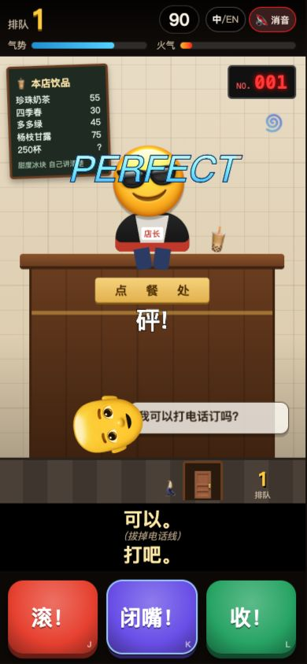
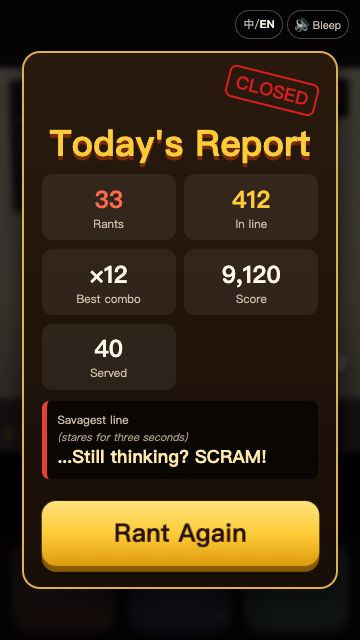

# 来250杯原型验收报告

验收日期：2026-10-02。被测代码：`dd0ce52`，包含远端 `cc6f65c` 及之前的配音流程和语音淡出优化，以及本次战报印章布局修复。依据：[验收清单](acceptance-checklist.md)。

结论：基础玩法可以试玩，尚未达到完整验收标准。单元测试 45/45 通过；内容检查 14/17 通过，失败项均与未提交的语音包有关。另确认中文 #24 含性别笑点，以及游戏中切换英文后仍残留中文。自动浏览器脚本受本机依赖缺失阻塞，实际浏览器抽查不能替代完整 QA 矩阵。

环境：macOS、Node v25.2.1、Google Chrome、本机 HTTP 服务。实际查看 390×844、360×640、1280×800；1280×800 只检查开始卡，另在默认桌面视口复现语言切换问题。未进行真机听音、音色或情绪验收。最初一轮试玩发生在配音提交同步前；同步配音流程后重新运行单元与内容检查，并复查启动、语言切换和缺失语音资源；整合后续语音淡出提交后再跑两类自动检查，结果仍为 45/45 和 14/17。截图对应同一套未变更的 UI，未对新增淡出效果做听音确认。

## 逐项结果

命令均从 `game/` 执行。⚠️ 表示部分验证或环境阻塞，不计为通过。

| 编号 | 结果 | 证据 |
|---|---|---|
| A1 | ✅ 通过 | `node --test test/*.test.mjs`：`tests 45`、`pass 45`、`fail 0`。清单中的 44 已过时，新提交增加了 clipKey 测试。 |
| A2 | ❌ 失败 | `node tools/check-content.mjs`：`14/17 checks passed`，退出码 1；V1、V2-zh、V2-en 失败。 |
| A3 | ⚠️ 阻塞 | `node tools/play-integrate.mjs` 退出码 1：`Cannot find module '/opt/node22/lib/node_modules/playwright'`。未产出成功的 smoke JSON。 |
| A4 | ⚠️ 阻塞 | `node tools/qa.mjs` 同样缺少 Playwright；没有获得 `21/21 passed`，未安装 Chromium。 |
| B1 | ✅ 通过 | A2 的 B1-zh、B1-en 均 PASS；各 `count=100`，编号 1–100。 |
| B2 | ✅ 通过 | A2 的 B2-zh、B2-en 均 PASS；必需字段、风格、按键合法。 |
| B3 | ✅ 通过 | A2 的 B3 PASS；中英文 style、key、cups 一致。 |
| B4 | ✅ 通过 | A2 的 B4-zh、B4-en 均 PASS；包括系统台词、里程碑和 signature250 数据。数据存在不代表已接入完整演出。 |
| C1 | ✅ 通过 | A2 的 C1 PASS；另逐条阅读中英文各 100 位顾客，未发现外送角色。 |
| C2 | ⚠️ 部分 | 自动 C2 PASS，但关键词未覆盖中文 #28 的“觉醒”、#30 的“炼丹”、#96 的“封印”，英文 #30 有 alchemy、#96 有 SEALED；建议按中二演出红线复审。 |
| C3 | ✅ 通过 | 自动 C3 PASS，`curse=11`。这是 style 分类计数，不是逐句粗口统计。 |
| C4 | ✅ 通过 | 自动 C4 PASS；#47 cups=250，且 250 风格顾客数量满足阈值。 |
| C5 | ✅ 通过 | 自动 C5 PASS；黄金比例最好喝、两个月、下一位均存在。 |
| C6 | ✅ 通过 | 自动 C6 PASS，`default=0`；main.js 未覆盖为扣分。 |
| C7 | ✅ 通过 | 自动 C7 PASS：`aura 60 -> 60, queue=1`。 |
| C8 | ❌ 失败 | 中文 #24 alt：“这才是男人的饮料！”直接使用性别评价。另将 #56 alt 的胡子舞台指示列为可疑项；它也可能仅用于表现等待时间，不判定为额外失败。 |
| C9 | ✅ 通过 | 人工阅读两种语言全部顾客；#24、#50、#66、#100 的短暂软化由点单或事件触发，随后恢复收钱、等待或赶客，未发现按人群设置的温柔豁免。 |
| C10 | ✅ 通过 | engine.press 无受保护顾客分支；所有顾客 key 合法。C7 及连续按错玩满 90 秒的单测通过。 |
| D1 | ⚠️ 部分 | 手机和 1280×800 桌面开始卡可用；桌面 `pageWidth=1280`；Chrome 所捕获日志为 `[]`。新版本的语音 manifest HTTP 404，不能声明所有资源均无错误。 |
| D2 | ✅ 通过 | 390×844 点击开店后的首个状态：90 秒、NO.001、顾客半个头、标记、名称、气泡和耐心条完整出现。未精确测量首帧毫秒数。 |
| D3 | ✅ 通过 | 实际 J 键操作出现 PERFECT、拍台字幕、顾客飞离、排队从 0 到 1；[游戏截图](acceptance-gameplay-2026-10-02.jpg)。 |
| D4 | ⚠️ 部分 | 浏览器混合按键会增加排队且显示台词；引擎定向复核：`auraBefore=60, auraAfter=60, queue=1`。未在同一浏览器顾客上采集精确气势前后值。 |
| D5 | ⚠️ 部分 | 实际闲置出现服务腔文字，最终 3 次“被迫客气”、0 接客后结算；超时扣 20 气势单测通过。未保存粉屏与僵笑瞬间的截图。 |
| D6 | ⚠️ 部分 | 实玩捕获红色爆气、连续字幕、×9 连击、排队 30；引擎定向复核 `phase7999=rage, phase8000=playing`。未对完整 8 秒浏览器动画计时。 |
| D7 | ⚠️ 部分 | 实玩出现 `10+ 排到门口了！`；引擎定向运行产生 `levels=[10,100,1000], queue=1013`。未在实际一局中观察全部三张卡片。 |
| D8 | ⚠️ 部分 | 引擎定向复核 #47：`cups=250, key=take, correct=true, queueDelta=11`；main.js 对该条件调用 250 特效。未在随机实玩中捕获 #47 的金字画面。 |
| D9 | ✅ 通过 | 实玩战报显示 21 次开骂、30 人排队、×9、1430 分、5 次被迫客气、12 接客及最狠一句；未见 undefined/NaN，点击重开恢复游戏。 |
| D10 | ❌ 失败 | 开始卡及战报文字可切英文；游戏中切换后按钮和菜单已英文，但当前顾客、气泡、旧字幕仍中文：[复现截图](acceptance-language-2026-10-02.jpg)。 |
| D11 | ✅ 通过 | 点击消音后状态为 `🔇 Bleep`、pressed=true；刷新后的中文开始卡仍为 `🔇 消音`、Value=1。只验证设置保存，不等于听音通过。 |
| D12 | ⚠️ 部分 | 360×640 中英文战报无横向溢出；修复后英文印章到标题间距 7.3px、中文 11.9px，按钮底部约 566px，小于 640px。[英文战报](acceptance-summary-2026-10-02.jpg)。未覆盖所有长字幕和特效组合。 |
| E1 | ❌ 失败 | `curl` 请求本机 `/voice/manifest.json` 返回 HTTP 404；仓库无 `game/voice/`，V1 失败。 |
| E2 | ❌ 失败 | 缺少 AI 配音资源，覆盖检查 zh 为 0/361、en 为 0/357；无法按标准播放不同顾客的 AI 音色。浏览器 TTS 回退不等于此项通过。 |
| E3 | ⚠️ 部分 | 舞台指示剥离单测通过，源码包含新台词取消旧 speech 的路径；AI 语音包缺失，未验证实际声音与打断效果。 |
| E4 | ❌ 失败 | main.js 调用两次群众 announce，但 audio.announce 在找不到 clip 时直接返回；缺包时无法播放两句 AI 群众嘘声。服务腔回退和合成嘘声仍需听音确认。 |
| E5 | ❌ 失败 | 里程碑调用 announce，但缺少 clip 时静默返回；播报员语音无法按标准播放。 |
| E6 | ⚠️ 部分 | splitForBleep 和 buildSpeechPlan 单测通过；未验证真实声音是否为 1kHz，也未验证缺失的预制消音片段。 |
| E7 | ⚠️ 部分 | main.js 切语言会调用 audio.setLang、stopSpeech；没有英文 AI 资源，未做英文听音。 |
| E8 | ⚠️ 部分 | audio.js 保留 WebAudio 合成音效；没有提交其他音频文件。未完成听音及全程网络请求审计。 |

## 失败项详情

- **A2、E1、E2、E4、E5：配音包缺失。** 从本分支全新拉取后运行内容检查即可复现 V1/V2 失败，打开 manifest URL 得到 404。期望提交或可复现地生成 manifest 和其引用的 mp3 文件，再达到 17/17，并进行真机听音。本次仅验收，未下载模型或生成配音资源。
- **C8：中文 #24 性别笑点。** 查看 `game/src/content.zh.js` 第 24 位顾客的 alt。期望笑点仅来自点单行为；`docs/lines-zh.md` 的 v3 #24 已改为按四样料算账，游戏内容尚未同步。
- **D10：中途切语言不刷新已有文本。** 打开 `?lang=zh`，开店后立即切换“中/EN”。按钮变为 Beat it / Zip it / Rung up，截图中的顾客“浓茶”、气泡“茶可以浓一点吗？”及字幕“下一题！”仍为中文。`setLang()` 只刷新静态文案、开始卡或结算卡，没有重绘当前顾客和已有字幕。期望所有当前可见文本同步变为目标语言。
- **A3、A4：本机依赖路径不适用。** 两条脚本均先找本地 playwright，然后回退到 Linux 路径 `/opt/node22/lib/node_modules/playwright`；本机未找到两者，启动即退出。需要配置测试依赖和浏览器路径后重跑，不能把手工试玩记为 21/21。

本次已修复一处验收前发现的 UI 问题：360×640 英文战报中 CLOSED 印章遮挡标题。`dd0ce52` 将印章改为正常文档流并留出间距，中英文页面复查通过。其余失败项仅记录，没有修改玩法、台词或配音流程。

## 已知问题现状

| 编号 | 现状 | 证据 |
|---|---|---|
| F1 | 仍存在 | v3 台词表 #24 已写 100 杯和算账变体；游戏 #24 仍是无杯数的旧台词，含性别笑点。 |
| F2 | 仍存在 | content.en.js 的 #84、rageLines 仍含 Code 250；配音稿要求 quarter-wit 口误流程。signature250 数据中虽有 quarter-wit，完整流程未接入。 |
| F3 | 仍存在 | UI 松手才调用 onPress；引擎按 patience 消耗计算 reactionMs，没有按下冻结计时接口。正常实时长按超过 800ms 不满足小于 600ms 的 perfect 条件。 |
| F4 | 仍有风险 | main.js 可在同一次 resolve 触发 hit、250/perfect 和 milestone，UI 没有统一演出排队。未系统复现所有小屏叠加组合，不将此项宣称为已修复。 |
| F5 | 仍存在 | 实际不操作时约 10 秒内出现战报，3 次被迫客气后结束；默认气势 60，每次超时 -20。 |
| F6 | 未能听音确认 | Kokoro 流程和语速设置已入库，但生成资源缺失；无法判断情绪和“秒回正经”的实际听感。 |
| F7 | 仍存在 | 主页面明确显示“来250杯”“排队”“气势”等简体，root.lang 为 zh-Hans。 |

## 主观评价

节奏很快，按键、飞人和排队增长能立即反馈操作；但新玩家还没弄懂标记与按键关系，就可能连续超时结束。讽刺点单行为的台词有辨识度，例如电话点单时拔电话线；完整“250 杯、两个月”段子还没有作为招牌演出发挥出来。

最爽的是拍台、PERFECT 和爆气同时强化按键反馈。重复游玩最容易疲劳的是柜台与 Emoji 角色变化有限，以及语音/台词经常来不及完整呈现。这里仅评价可见交互，没有以未听过的音效质量作为依据。

最值得优先处理的三件事：

1. 补齐语音交付与测试环境，使新拉取的代码可以通过 17/17 内容检查及完整 21 场景浏览器 QA，再安排真机听音。
2. 同步 v3 台词，先消除 #24 的性别笑点，并复审 #28、#30、#56、#96 等可疑内容。
3. 修复游戏中语言切换时的中文残留，并改善首次进入游戏的操作说明与超时宽容度。

