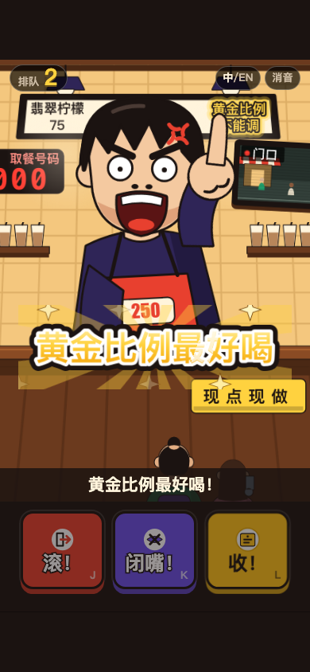

# 《来250杯！》原型验收报告

验收日期：2026-10-03。被测游戏提交：`57eec88`（当前分支另有只修改 `AGENTS.md` 的验收规则提交 `6b3ee77`）。验收执行模型：`gpt-5.6-sol`，reasoning effort `medium`。

结论：A1–A6 的要求均通过。实际单测数是 173，清单 A1 的“154”已过时。自动验收没有发现新的游戏实现失败；第 1 天节奏仍低于“约 13 人”：从答题窗口起算 700ms 反应时平均 10.3 人，从牌子举好起算平均 12.0 人。真实手机上的音色、发音、混音和手感仍需人工验收，因此不能宣布整份清单全部通过。

环境：macOS、Node v25.2.1、Playwright 1.63.0、缓存 Chromium；浏览器脚本设置 `PLAYWRIGHT_BROWSERS_PATH=/private/tmp/naicha-pw-browsers` 并严格顺序运行。完整关键输出见[自动化日志](acceptance-automation-2026-10-03.log)。

## 逐项结果

| 编号 | 结果 | 证据 |
|---|---|---|
| A1 | ✅ 通过 | `node --test test/*.test.mjs`：`tests 173`、`pass 173`、`fail 0`。分项与 README 的 173 一致，验收清单的 154 不一致。 |
| A2 | ✅ 通过 | `node tools/check-content.mjs`：`23/23 checks passed`；中文片段 442/442，英文 441/441。 |
| A3 | ✅ 通过 | 中英各跑一次，均退出 0。中文/英文开场 34.518s/38.656s，首牌 2.433s/2.345s；`enginePhases=[idle]`、无计时条、打烊卡防误触通过、day 2/战报/下一局正确、`overflow=false`、`errors=[]`。 |
| A4 | ✅ 通过 | `26/26 checks passed`。双视口首牌 2.744–2.831s；正确路线 34.468–34.763s；乱按路线 85.303s，4 次错按均在 300ms 内有吐槽；全超时路线 67.737s，W1–W4 各超时一次。 |
| A5 | ✅ 通过 | `15/15 checks passed`。开场 250 金牌、S2、调你妈、黄金比例、No.001 和队列 2→12；自由营业 250 增加 11 人且 2.159s 后正常上下一位；第 3 天两步顾客完整通过。 |
| A6 | ✅ 通过（重试后） | 390×844 的 play/skip 通过；首轮本地服务日志管道阻塞，使 360×640 三次 `page.goto` 在断言前超时。清空日志并重启后，360×640 `19/19`：首牌 2.566s、无重叠、跳过后舞台清理正确；A13 为 1/2048 长帧（0.0%），SVG 节点最大 330。 |
| B1 | ✅ 通过 | A2：中英文各 100 位，编号 1–100。 |
| B2 | ✅ 通过 | A2：名称、台词、变体、风格和按键字段合法。 |
| B3 | ✅ 通过 | A2：中英文 style/key/cups 全部一致。 |
| B4 | ✅ 通过 | A2：系统、开场、提示、解锁、原片顾客和里程碑字段齐全；旧 `signature250` 已删除。 |
| C1–C7 | ✅ 通过 | A2 全部 PASS；明骂风格 10 位；250 和三句招牌台词存在；默认 `auraWrong=0`，按错仍增长队伍。 |
| C8 | ✅ 通过 | 人工逐条审阅中英各 100 位的 `says/reply/alt`，未发现拿外貌、性别、种族、出身、政治或宗教开玩笑的台词。 |
| C9 | ✅ 通过 | 人工审阅未发现受保护顾客或特别温柔的人群。#15、#24、#50、#56 的短暂软化均立即切回凶态，属于规定的反差。 |
| C10 | ✅ 通过 | 内容无“憋住不骂”规则；引擎无受保护分支，所有顾客都使用同一答题/骂出流程。 |
| D1 | ⚠️ 部分 | 开始卡、两种手机视口、横向溢出和 console 由 A3/A4 覆盖；本轮没有单独实测 1200ms 前的提前点击。 |
| D2 | ✅ 通过 | A3/A4/A6：完整剧本后进入第 1 天，`phase=playing`、queue=12，遮盖、引导、黑边和号码牌均已清理。 |
| D3 | ✅ 通过 | A4 验证正确键、等待语音结束和落地间隔；最短正确命中到下一位 1.277s/1.287s，花字与牌子 49 拍零重叠。 |
| D4 | ✅ 通过 | A2 直接验证按错后气势 60→60、队伍 +1；A4 错按吐槽和引导均通过。 |
| D5 | ⚠️ 部分 | A4 验证开场四个等待点的服务腔超时；单测验证第 1 天超时不扣气势、第 2 天起扣气势。本轮未独立录像核对第 2 天气势条滑入动画。 |
| D6 | ⚠️ 部分 | 引擎/集成单测覆盖爆气开始、乱按命中和 8 秒恢复；本轮没有单独完成第 3 天约 30 秒真机视觉体验检查。 |
| D7 | ⚠️ 部分 | 单测覆盖 10/100/1000 依次触发且不暂停；本轮浏览器脚本未逐张人工核对三张里程碑卡。 |
| D8 | ✅ 通过 | A5 自由营业 250：正确按收后 queueDelta=11、big landing、无暂停或长演出。 |
| D9 | ✅ 通过 | A3 中文和英文打烊卡均出现，卡片前末句读完；1 秒内点卡仍保留，按钮后进入第 2 天。截图也确认号码牌、标题、迷你牌和大按钮。 |
| D10 | ✅ 自动流程通过 | A3：第 2 天战报出现，下一局 day 与 expectDay 相同，`250cups.day=2`。本轮未覆盖战报卡显示期间即时切换语言这一边界。 |
| D11 | ✅ 主流程通过 | 英文 A3 从开始卡跑到 day 2 战报，英文资源和布局无错误；单测覆盖中英结构一致。本轮未逐个阶段现场切换。 |
| D12 | ⚠️ 部分 | 音频单测覆盖中英敏感词切分与 1kHz bleep 片段；未真机听音，也未在刷新后人工核对开关保留。 |
| D13 | ⚠️ 部分 | UI/引擎单测覆盖按下结算及 300/800ms 蓄力、错按不蓄力；本轮未做长按手势的浏览器专项。 |
| D14 | ✅ 通过 | A4/A6：第 1 天 HUD 只显示排队，气势、火气、倒计时和低连击均未出现。 |
| D15 | ✅ 通过 | A5：第 3 天先金牌 250，收后变紫牌“少甜少冰”，闭嘴后进入“调你妈！黄金比例最好喝！”收尾。 |
| D16 | ⚠️ 部分 | 10 个繁体单测通过，包括全部源码汉字覆盖、台湾用词和幂等转换；本轮未单独跑 zh-TW 浏览器全流程目视。 |
| D17 | ✅ 通过 | 引擎单测验证池用完前不重复；第 1 天首个收单限定由实现/测试覆盖。节奏实测三种子均 0 超时。 |
| D18 | ⚠️ 部分 | A3 确认第 2 天 clock 可见；未单独读取 DOM 核对“87 秒 / 87 s”的单位文本。 |
| H1–H4 | ✅ 通过 | A4/A6：首牌 2.345–2.831s，剧本引擎始终 idle、无计时条；P4 后到可答 14.665–14.683s；三次错按均及时响应且 W3 二错自动推进。 |
| H5–H8 | ✅ 通过 | A5/A6 的 D4、E4、E6、E12 截图和状态：250 金牌、闭嘴解锁、调你妈独占与锁键、黄金比例、票据、队列 +10 均通过。 |
| H9 | ✅ 通过 | A4 全超时路线 67.737s，W1–W4 各一次，低于 70s。 |
| H10 | ✅ 通过 | A6：首次无跳过；回访 1.529s 出现跳过，直接进复盘，再进入 day 1 queue=12，舞台清理完成。 |
| H11–H13 | ⚠️ 部分 | 49 个 beat 花字/牌子零重叠；A6 截图覆盖 E10/E12、黑边和复盘。H12/H13 的每个过渡帧未逐帧人工审看。 |
| I1–I7 | ✅ 自动与截图通过 | A2/A6：无 emoji、外部图片、filter/blur；360×640 字体/牌子/按键尺寸合格；最大 SVG 节点 330；4×CPU 长帧 0.0%。新版美术见下图。 |
| E1 | ✅ 自动验证通过 | A2 V1/V2/V3 全通过；A3/A4 页面无资源错误，中文 442/442、英文 441/441 片段齐全。 |
| E2–E9 | ⚠️ 待真机听音 | 代码与自动化覆盖不同角色片段、舞台指示剥离、切点、服务腔/嘘声调用、里程碑播报、bleep、切英文、合成音效和“250→二百五十”的文本计划；本轮没有真实设备人耳证据，不虚构发音、情绪或混音结论。 |

## 失败项详情

没有 A1–A6 自动化失败。需要继续处理的产品差距是第 1 天节奏：使用已发布中文语音片段、700ms 反应、种子 1/2/3，答题窗口起算分别服务 10/11/10 人，平均 10.3；从牌子举好起算均为 12 人，平均 12.0。两种口径都低于规格目标“约 13”。该问题已列在 F10，因此本轮不将它重复计为 A 项失败。

首轮 A6 的 360×640 三项失败发生在 `page.goto`、页面断言执行之前。本地 Python 服务的访问日志写满 PTY 后停止响应；清空日志、重启服务并隔离重跑后 19/19 通过。节奏工具另遇到外部 Google Fonts 请求挂住 `load`，已在验收工具中拦截该域名，使用项目既有系统字体回退；不改变游戏或语音计时。

## 已知问题现状

| 编号 | 现状 | 证据 |
|---|---|---|
| F1 | 确认已解决，保留内容决策 | 中英各 100 位及字段一致；#57 仍按配音稿备用句，#34/#67/#77/#90 的主/变体选择属于已记录制作决策。 |
| F2 | 主要问题已解决，删除线字幕仍未实现 | 英文无 CODE 250，quarter-wit / out of a thousand / a two-fifty 方案已落地；口误以普通文字显示。 |
| F3 | 确认已解决 | 单测覆盖按下即结算与同一回答 300/800ms 蓄力。 |
| F4 | 确认已解决 | `createFxQueue` 单测验证大特效串行；截图未见旧版多张大卡同时占中心。 |
| F5 | 确认已解决 | 第 1 天超时免费、第 2 天扣气势的单测通过。 |
| F6 | 仍存在 | Kokoro 片段齐全，但情绪和真人表演限制仍需真机听审。 |
| F7 | 显示层与台湾用词已解决，语音遗留仍在 | 繁体与台湾词表单测通过；语音仍来自简体文本/普通话音色。 |
| F8 | 无头 A13 本轮通过，真机仍待测 | 4×CPU 为 1/2048 长帧（0.0%），最大 330 SVG 节点；不能替代目标手机。 |
| F9 | 确认已解决 | 单测保证原片顾客不在 rage 中出现且不会触发 rage；A5 两步流程通过。 |
| F10 | 仍存在 | t0 口径平均 10.3 人，sign-up 口径平均 12.0 人，仍低于约 13。 |
| F11 | 确认已解决 | V2-zh 442/442、V2-en 441/441，新增半句与台词均有 clip。 |

## 主观评价

新版 SVG 的层次和色彩已经能一眼读出“高柜台、半个头顾客、红紫金三键”，250 金牌与“调你妈→黄金比例”是最清楚也最有记忆点的爆点。开场约 35 秒，乱按和全超时路线也能收束；自由营业从 t0 起算只有约 10 人，听完整台词时仍显得偏慢。

最值得优先改的 3 件事：

1. 在目标手机上完整听一遍中英语音，重点核对“250”读法、切点静音、bleep 覆盖和服务腔/群众叠音。
2. 把第 1 天 t0 口径从平均 10.3 人推进到更接近 13，同时保住字幕可读和落地停顿。
3. 补齐浏览器专项：繁体全流程、长按蓄力手势，以及里程碑/战报显示中即时切换语言。

